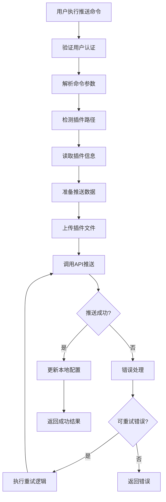

# 插件推送实现文档

## 概述

本文档详细说明了 `fx-cli` 工具中插件推送功能的实现逻辑，包括命令行接口、服务层处理、API 交互、错误处理机制以及版本冲突解决方案。

## 架构概览

插件推送功能采用分层架构设计：

1. **命令层**：`src/commands/push.js` - 处理用户输入和参数解析
2. **服务层**：`src/services/pushPluginService.js` - 实现插件推送核心逻辑
3. **API 层**：`src/utils/api.js` - 与服务器通信
4. **配置层**：`src/utils/configManager.js` - 管理配置和项目信息

## 命令行接口

### 命令格式

```bash
fx push plugin [options]
```

### 参数说明

- `--path` 或 `-p`: 指定插件路径（可选，默认为当前目录）
- `--name`: 指定插件名称（可选，默认从路径或配置中获取）

### 自动类型检测

系统会根据以下规则自动检测文件类型：
- 文件扩展名：`.js`、`.ts` 等
- 文件名模式：包含特定关键词
- 目录结构：检查是否存在 `plugin.xml` 文件

## 核心实现逻辑

### 1. 插件推送流程

插件推送的核心流程如下：



### 2. 插件信息收集

系统会收集以下插件信息：

- **基本信息**：
  - 插件名称：从目录名或 `plugin.xml` 中获取
  - 插件ID：添加 `__c` 后缀
  - 插件类型：固定为 `plugin`

- **文件结构**：
  - 源代码文件：`sourceFiles` 或 `fileTree` 目录
  - 静态资源：`static` 目录下的图片等资源
  - 配置文件：`plugin.xml` 描述文件

- **版本信息**：
  - `updateTime`：从 `unchangeableJson.json` 获取或设为 0
  - 用于版本控制和冲突检测

### 3. 文件上传处理

系统支持三类文件上传：

1. **源代码文件** (`sourceFiles`)：
   - 单个文件上传
   - 构建包含 `fileSize`、`fileName`、`filePath` 的文件对象

2. **文件树** (`fileTree`)：
   - 整个目录上传
   - 递归处理目录结构

3. **静态资源** (`images`)：
   - 读取 `static` 目录
   - 构建图片文件对象数组

每个文件上传后会收到 `TempFileName`，用于后续 API 调用。

### 4. API 请求构建

系统构建以下请求数据结构：

```javascript
const data = {
  name: pluginName,
  mateXml: xmlContent,
  apiName: pluginId,
  type: 'plugin',
  updateTime: updateTime,
  sourceFiles: [...], // 或 fileTree
  images: [...]
};
```

### 5. 版本控制与冲突处理

#### 版本控制机制

- 每个插件维护一个 `updateTime` 时间戳
- 新插件首次推送时 `updateTime` 设为 0，由服务器生成
- 已有插件从 `unchangeableJson.json` 读取本地 `updateTime`

#### 冲突检测与解决

当检测到"当前代码在线上有更高版本"错误时：

1. **获取最新版本信息**：
   ```javascript
   const pluginInfo = await getPlugin(pluginId);
   const latestUpdateTime = pluginInfo.updateTime;
   ```

2. **更新本地配置**：
   ```javascript
   // 更新 unchangeableJson.json 中的 updateTime
   unchangeableJson[pluginKey].updateTime = latestUpdateTime;
   ```

3. **重试推送**：
   ```javascript
   data.updateTime = latestUpdateTime;
   const retryResponse = await api.uploadComponent(data);
   ```

### 6. 错误处理机制

系统实现了多层次的错误处理：

#### 错误分类

1. **系统提示类错误**：
   - 无效响应
   - 状态码非 0
   - 系统提示降级

2. **特定错误类型**：
   - "已存在相同的 apiName"
   - "系统出现异常"
   - "当前代码在线上有更高版本"

#### 重试策略

1. **"系统出现异常"错误**：
   - 将 `updateTime` 设为 0 重试
   - 让服务器生成新的时间戳

2. **"当前代码在线上有更高版本"错误**：
   - 从服务器获取最新 `updateTime`
   - 更新本地配置后重试

3. **其他错误**：
   - 记录错误日志
   - 返回错误信息

### 7. 本地配置更新

推送成功后，系统会更新本地的 `unchangeableJson.json` 文件：

```javascript
// 智能判断插件键名
const originalPluginKey = `plugin:${pluginName}`;
const sanitizedPluginKey = `plugin:${sanitizedPluginName}`;

// 更新或创建插件记录
if (unchangeableJson[pluginKey]) {
  unchangeableJson[pluginKey].updateTime = latestUpdateTime;
} else {
  unchangeableJson[pluginKey] = {
    apiName: pluginId,
    type: 'plugin',
    updateTime: latestUpdateTime,
    name: pluginName
  };
}
```

## 部署流程

除了基本推送功能，系统还提供了完整的部署流程：

```javascript
const deployPlugin = async (pluginPath, type = 'plugin', env = 'dev') => {
  // 1. 推送代码
  const pushResult = await pushPlugin(pluginPath, type);
  
  // 2. 构建插件
  const buildResult = await api.buildComponent(pushResult.id);
  
  // 3. 部署到指定环境
  // 部署逻辑...
  
  return {
    success: true,
    name: pushResult.name,
    id: pushResult.id,
    buildId: buildResult.buildId,
    env: env
  };
};
```

## 项目结构要求

插件推送功能对项目结构有以下要求：

```
fx-app/
└── main/
    └── PWC/
        └── plugins/
            └── YourPlugin/
                ├── plugin.xml    # 必需：插件描述文件
                ├── index.js      # 插件入口文件
                ├── sourceFiles/   # 源代码目录（可选）
                ├── fileTree/      # 文件树目录（可选）
                └── static/        # 静态资源目录（可选）
                    └── images/    # 图片资源
```

## 最佳实践

1. **插件命名**：
   - 使用有意义的名称
   - 避免特殊字符
   - 保持名称一致性

2. **版本管理**：
   - 定期更新插件
   - 解决版本冲突时及时同步
   - 保留 `unchangeableJson.json` 文件

3. **错误处理**：
   - 查看详细错误日志
   - 根据错误类型采取相应措施
   - 必要时使用强制更新

4. **目录结构**：
   - 保持标准目录结构
   - 确保包含 `plugin.xml` 文件
   - 合理组织源代码和资源

## 常见问题与解决方案

### Q: 推送时提示"当前代码在线上有更高版本"

**A**: 这是版本冲突错误，系统会自动尝试解决。如果自动解决失败，可以：

1. 手动删除本地 `unchangeableJson.json` 中的插件记录
2. 使用强制更新（将 `updateTime` 设为 0）
3. 联系管理员检查服务器状态

### Q: 推送失败提示"已存在相同的 apiName"

**A**: 这表示插件ID冲突。解决方案：

1. 检查插件名称是否重复
2. 修改插件名称或ID
3. 使用不同的插件目录

### Q: 文件上传失败

**A**: 可能的原因和解决方案：

1. 检查文件路径是否正确
2. 确认文件权限
3. 检查网络连接
4. 查看服务器存储空间

## 总结

插件推送功能是 `fx-cli` 工具的核心功能之一，它提供了完整的插件开发、部署和版本管理解决方案。通过智能的冲突检测和解决机制，确保了插件更新的可靠性。同时，详细的错误处理和日志记录功能，帮助开发者快速定位和解决问题。